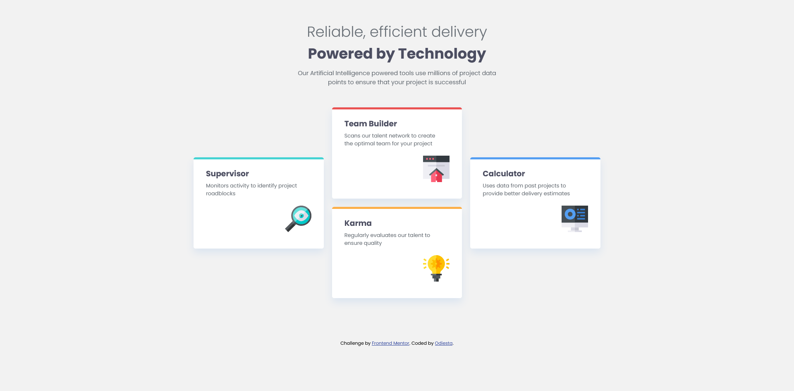

# Frontend Mentor - Four card feature section solution

This is a solution to the [Four card feature section challenge on Frontend Mentor](https://www.frontendmentor.io/challenges/four-card-feature-section-weK1eFYK). Frontend Mentor challenges help you improve your coding skills by building realistic projects.

## Table of contents

- [Frontend Mentor - Four card feature section solution](#frontend-mentor---four-card-feature-section-solution)
  - [Table of contents](#table-of-contents)
  - [Overview](#overview)
    - [The challenge](#the-challenge)
    - [Screenshot](#screenshot)
    - [Links](#links)
  - [My process](#my-process)
    - [Built with](#built-with)
    - [What I learned](#what-i-learned)
    - [Challenges faced](#challenges-faced)
    - [Continued development](#continued-development)
    - [Useful resources](#useful-resources)
    - [AI Collaboration](#ai-collaboration)
  - [Author](#author)
  - [Acknowledgments](#acknowledgments)

**Note: Delete this note and update the table of contents based on what sections you keep.**

## Overview

### The challenge

Users should be able to:

- View the optimal layout for the site depending on their device's screen size

### Screenshot



### Links

- Solution URL: [Github](https://github.com/Odiesta/four-card-feature-section-master)
- Live Site URL: [Netlify](https://shiny-starburst-e8e544.netlify.app/)

## My process

### Built with

- Semantic HTML5 markup
- CSS custom properties
- Flexbox
- CSS Grid
- Mobile-first workflow

### What I learned

Working on this project taught me several new things:

1. **CSS Grid Layout** — Placing cards using `grid-row` and `grid-column` was challenging at first. I learned how to position elements on specific rows and columns, for example making the cyan and blue cards sit in the middle vertically:

```css
.card-cyan {
  grid-row: 2 / 4;
  grid-column: 1;
}

.card-red {
  grid-row: 1 / 3;
  grid-column: 2;
}
```

2. Box-shadow — I learned how to add subtle shadow effects to cards so they look like they're floating above the page.

3. Centering with margin auto — I was confused why my container wouldn't center, but it turned out I just needed margin: 0 auto on a container with a max-width.

4. Align-self in flexbox — To place the icon image on the right side of the card, I used align-self: flex-end inside a flex container.

### Challenges faced

I had some trouble with:

- Making the card columns align properly in the middle, both vertically and horizontally
- Understanding how grid-row works with numbers and span
- Placing the attribution section at the very bottom of the page

### Continued development

I want to keep learning more about:

- CSS Grid with more complex layouts
- Fully responsive layouts without too many media queries
- Better accessibility and semantic HTML

### Useful resources

- [CSS Tricks - A Complete Guide to Grid](https://css-tricks.com/snippets/css/complete-guide-grid/) — The most comprehensive grid guide out there
- [MDN Web Docs - CSS Grid Layout](https://developer.mozilla.org/en-US/docs/Web/CSS/CSS_Grid_Layout) — My go-to reference while learning grid

### AI Collaboration

I used GitHub Copilot with Deepseek model as my AI coding assistant while working on this challenge. Copilot helped me with:

- CSS Debugging — Helped me understand why some CSS properties weren't working as expected (e.g., margin-top: auto not working without min-height)
- Explaining concepts — Gave clear explanations of how CSS Grid, Flexbox, and box-shadow work with easy-to-understand analogies
- Providing hints — Instead of giving me the final code, Copilot guided me with hints so I could still learn along the way

## Author

- Frontend Mentor - [@Odiesta](https://www.frontendmentor.io/profile/Odiesta)
- Twitter - [@yourusername](https://www.x.com/Odiesta)

## Acknowledgments

Thanks to Frontend Mentor for providing free challenges to learn from. And to the community for being so supportive!
